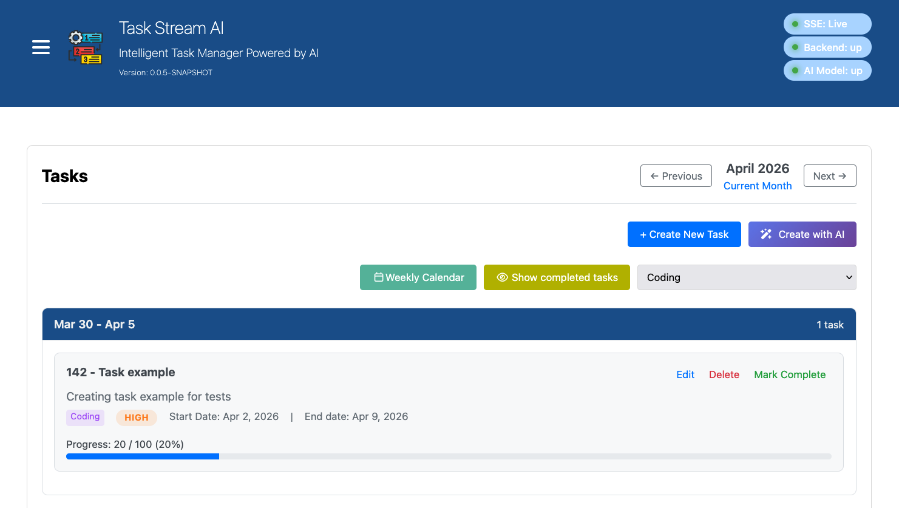
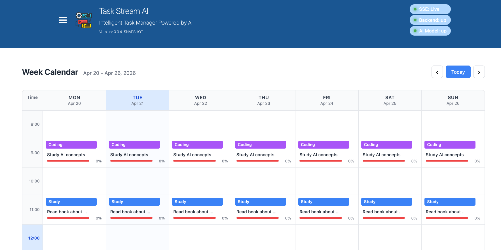
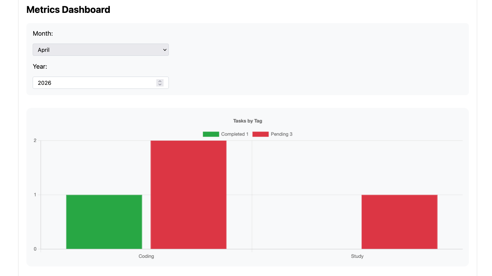
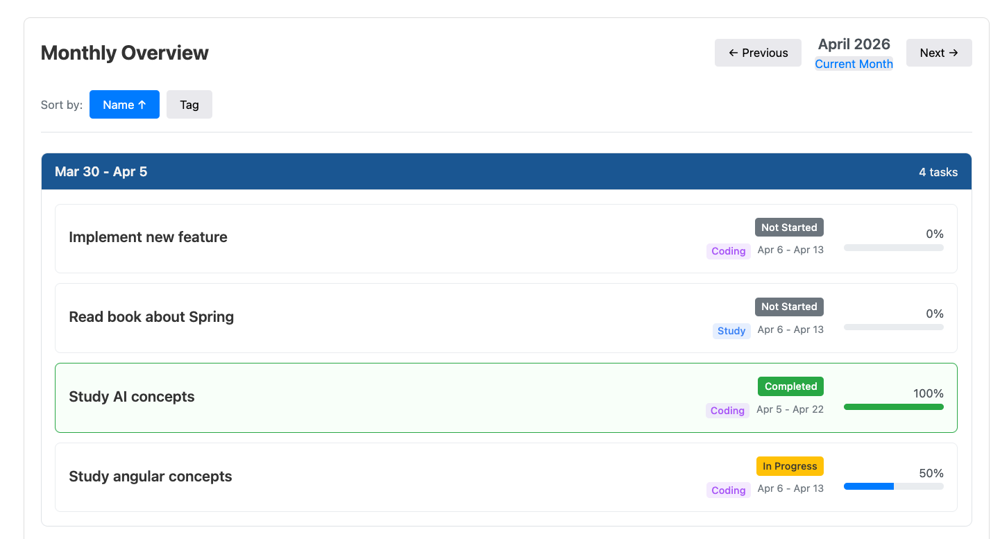

# TaskStream AI

A full-stack task management platform with AI-powered features, built with Kotlin Spring Boot and Angular.

> **AI Development Sandbox** — This application serves as a test environment for (1) AI-assisted software development, demonstrating AI pair programming capabilities, and (2) LLM integration via Spring AI 2 with local Ollama models.
> **Security Note** — This is a personal study project with minimal security features. Not intended for production use.

## Overview

TaskStream AI is a productivity platform for managing tasks, tracking time, and visualizing progress. It provides a weekly calendar for scheduling, tag-based organization, metrics dashboards, and optional AI features via Ollama integration. The application can run as a web service or be packaged as a native desktop app.

**Target Audience:** Users seeking structured task management with scheduling and productivity insights; developers exploring AI-assisted development workflows.

## Security Note
This is a personal study project. Security features like authentication, 
authorization, and input sanitization are intentionally minimal for simplicity. 
Not intended for production use or multi-user environments.

## Features

| Feature | Description |
|---------|-------------|
| **Task Management** | CRUD operations with priorities (Low, Medium, High, Critical) and progress tracking |
| **Tag System** | Color-coded tags for task categorization and filtering |
| **Weekly Calendar** | Schedule tasks in a Monday-Sunday view with multi-tag and multi-day assignment |
| **Monthly Overview** | Task summaries grouped by week with navigation |
| **Metrics Dashboard** | Visual charts showing task completion by tag and time period |
| **Database Backup** | On-demand backup and restore via admin panel |
| **AI Integration** | Optional Ollama integration for AI-powered features |

### AI Features
| Feature | Description |
|---------|-------------|
| **AI-Powered Summary** | Generate summaries of websites and blog posts linked to tasks |


## Architecture

### Tech Stack

| Component | Technology |
|-----------|------------|
| Backend | Kotlin 2.2.21, Spring Boot 4.1.0-M4 |
| Frontend | Angular 21.2.7, TypeScript 5.9.3 |
| Database | H2 (embedded) with Flyway migrations |
| AI | Spring AI 2.0.0-M4, Ollama |
| Desktop | Electron 41, GraalVM Native Image |

### Project Structure

```
task-stream-ai/
├── backend/           # Spring Boot REST API
│   ├── src/main/kotlin/br/com/taskstreamai/
│   └── README.md
├── frontend/          # Angular web application
│   └── README.md
├── desktop-app/       # Electron desktop wrapper
│   └── README.md
└── spec/              # Feature specifications (PRDs)
```

## Installation

### Prerequisites

- **Java 24+**
- **Maven 3.6+**
- **Node.js 18+**
- **Ollama** for AI features
- **GraalVM 24+** for native desktop build

### Quick Start (Web Mode)

1. Start the backend:
   ```bash
   cd backend
   ./mvnw spring-boot:run
   ```

2. Start the frontend:
   ```bash
   cd frontend
   npm install
   npm start
   ```

3. Open `http://localhost:4200`

### Desktop Build (macOS DMG)

Build everything with one command:
```bash
sh build.sh
```

Output: `desktop-app/release/TaskStream AI-x.x.x.dmg`

**Build time:** ~10-15 minutes (includes GraalVM native compilation)

## Usage

### Data Storage

All data is stored at `~/.task-stream-ai/`:
- H2 database files
- Backup exports
- Application logs

### Default Credentials

**H2 Console:** `http://localhost:8080/h2-console`
- JDBC URL: `jdbc:h2:file:~/data/h2/trackdailyapp`
- Username: `sa`
- Password: `password`

### API Base URL

`http://localhost:8080/api`

See [backend/README.md](backend/README.md) for endpoint details.

## Development

### Module Documentation

| Module | Description | README |
|--------|-------------|--------|
| Backend | REST API, database, AI integration | [backend/README.md](backend/README.md) |
| Frontend | Angular UI components | [frontend/README.md](frontend/README.md) |
| Desktop | Electron wrapper for native build | [desktop-app/README.md](desktop-app/README.md) |

### Feature Specifications

Detailed PRDs are located in `spec/features/`:

| Feature | PRD |
|---------|-----|
| Monthly Overview | `monthly-overview-prd.md` |
| Weekly Calendar | `weekly-task-calendar.prd.md` |
| Task Metrics | `task-metrics-dashboard.prd.md` |
| Database Backup | `database-backup-restore.prd.md` |
| Task Alarms | `task-alarm-notification.prd.md` |

## Screenshots




